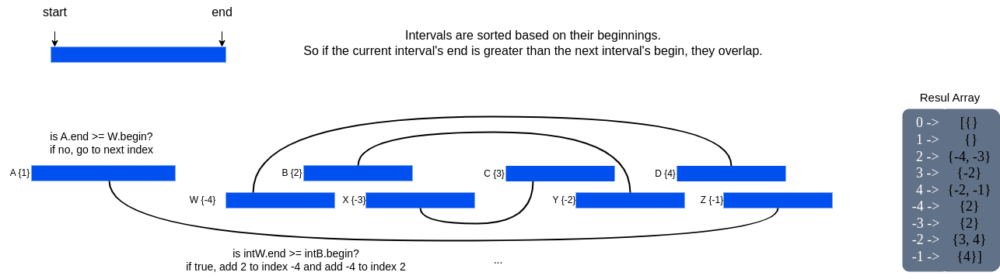
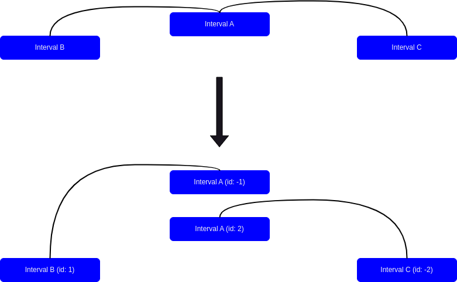
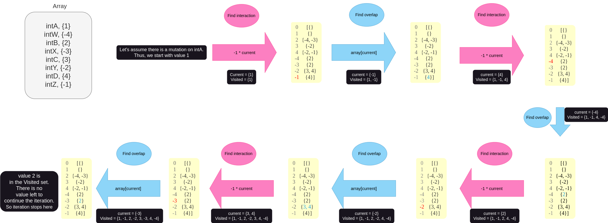

# MutationNetwork.py

## Installation

Script can be install via github directly with example input data.

### conda env

Before creating conda env, some channels should be added. ***It is going to change your config file!***

``` 
conda config --add channels conda-forge

conda config --add channels bioconda 
```

Now, the code above will create a conda env and install necessary packages.

``` 
conda create --name mutation_network python=3.10

conda install --name mutation_network --file requirements.txt

conda activate mutation_network
```

## Usage

usage: python MutationNetwork.py [-h] --bed\_files BED\_FILES [BED\_FILES ...] [-o [OUTPUT]] --bedpe\_files BEDPE\_FILES [BEDPE\_FILES ...] [--debug [DEBUG]] [-ow] [-v] [-r] [-s] [-dg [DRIVERGENES]] -md METADATA

example: 

```
python MutationNetwork.py --bedpe_files bedpe/*.bedpe.gz --bed_files mutations.csv -dg driverGenes.csv -md metadata.tsv -v
```

## Input Files

bedpe\_files --

bed\_file --

driver\_genes --

metadata --

## Method

### Step 1: processing bedpe


### Step 2: flowchart

<p align="center">


</p>

### Others







## Result file columns

intervals - number of intervals that the given mutation affects directly or indirectly

interactions - number of interactions between intervals that the given mutation affects directly or indirectly

overlaps - number of overlaps between intervals that the given mutation affects directly or indirectly

cycle\_rank - cycles rank of the graph which is created by intervals that the given mutation affects directly or indirectly

score - average score of the interactions between intervals that the given mutation affects directly or indirectly

{GeneType}\_range\_X\_NumOfInv - number of intervals that has overlap with given genes within X range

{GeneType}\_range\_X\_NumOfGen - number of genes that has shortes path lenght of X from the mutation in the graph

{GeneType}\_range\_X\_NamOfGen - name of genes that has shortes path lenght of X from the mutation in the graph

# MergeGenes.py

usage: MergeGenes.py [-h] -n NAMES -t TYPE -g GENCODE [-o [OUTPUT]]

example: 

```
python MergeGenes.py -names hugo_symbols.csv -type oncogenes -gencode gencode.v47.basic.annotation.gtf.gz
```

## Input Files

names (hugo\_symbols) -- at least one column csv file that contains hugo symbol of genes (Columns should be called "Hugo Symbols").

type (oncogenes) -- an arbitrary gene type

gencode (\*.annotation.gtf.gz) -- gencode file that has been downloaded from <https://www.gencodegenes.org/human/> (content: "Basic gene annotation", Regions: "CHR", Dowload: "GTF").
