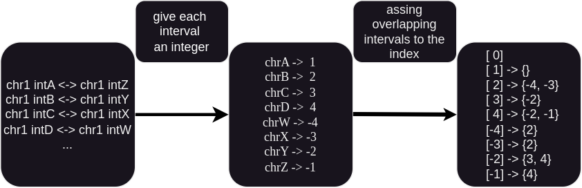
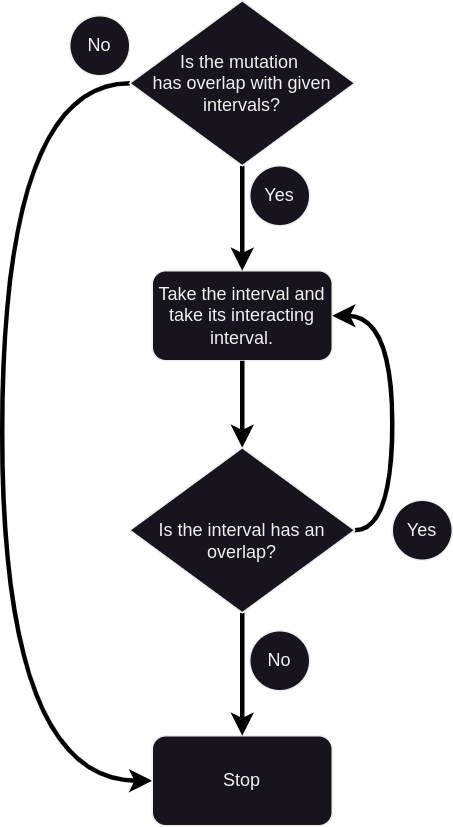

# invMutMapper.py -- Interval Mutation Mapper

## Installation

Script can be install via github directly with example input data.

### conda env

conda create --name mutation\_network python=3.10
conda install --name mutation\_network --file requirements
conda activate mutation\_network

## Usage

usage: python invMutMapper.py [-h] --bed\_files BED\_FILES [BED\_FILES ...] [-o [OUTPUT]] --bedpe\_files BEDPE\_FILES [BEDPE\_FILES ...] [--debug [DEBUG]] [-ow] [-v] [-r] [-s] [-dg [DRIVERGENES]] -md METADATA

Example: python InvMutMapper.py --bedpe\_files bedpe/\*.bedpe.gz --bed\_files mutations.csv -dg driverGenes.csv -md metadata.tsv -v

## Input Files

bedpe\_files -- 

bed\_file --

driver\_genes --

metadata --

## Method

### Step 1: processing bedpe

### Step 2: flowchart

  

## Result file columns

intervals - number of intervals that the given mutation affects directly or indirectly

interactions - number of interactions between intervals that the given mutation affects directly or indirectly

overlaps - number of overlaps between intervals that the given mutation affects directly or indirectly

cycles - cycles rank of the graph which is created by intervals that the given mutation affects directly or indirectly

score - average score of the interactions between intervals that the given mutation affects directly or indirectly

onco/ts\_range\_X - number of intervals that has overlap with given onco/ts genes within X range

onco/ts\_range\_X\_gene - number of genes that has shortes path lenght of X from the mutation in the graph

onco/ts\_range\_X\_list - name of genes that has shortes path lenght of X from the mutation in the graph

